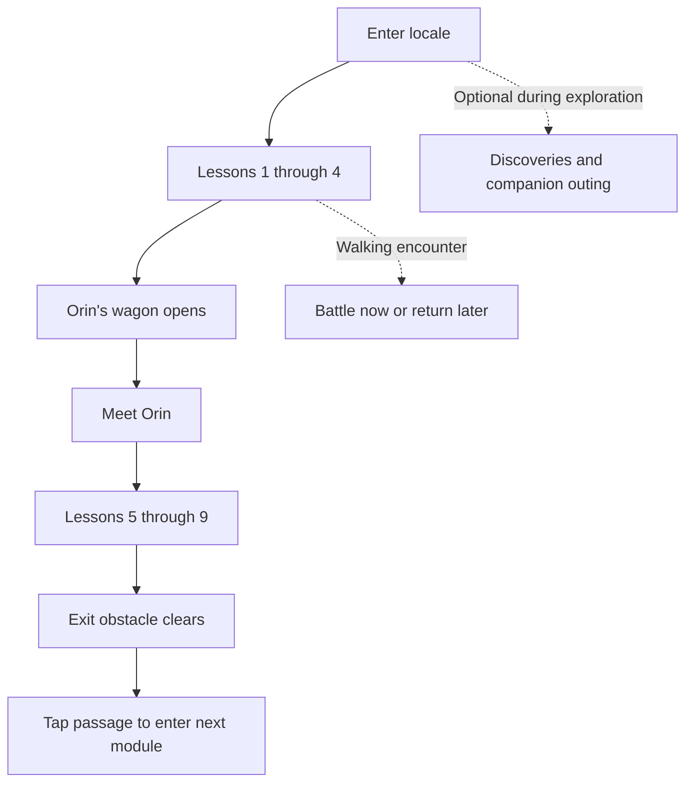

# Upskill Hero — explorable adventure screen specification

Status: interactive concept, implemented in this repository.  
Audience: product, design, and React Native engineering.  
Last updated: September 19, 2026.

This document captures the direction agreed during the prototype work and describes the current implementation. Sections marked **Proposed** or **Open decision** are not shipped functionality. The [README](README.md) explains the strategy and how to run or present the demo.

## 1. Objective and scope

Present the existing learning journey as a high-fantasy world that the player explores with a knight and companion. Keep learning progression understandable while offering optional detours, surprises, and visible environmental change.

The curriculum remains linear. Freedom comes from movement and optional discovery rather than branching lesson prerequisites. The design should have its own identity rather than reproducing a vertical chain of circular lesson buttons.

| In this prototype | Outside this prototype |
| --- | --- |
| Walking, camera following, light collision, and tap navigation | A complete open-world game or physics engine |
| Lesson landmarks, entry animations, and completion states | Real lessons, scoring, or assessment |
| Orin’s traveling wagon and module exits | New curriculum or content authoring tools |
| Hidden discoveries and companion hints | Live fact API, article/image delivery, or rewards economy |
| Ambush reveal, defer action, persistent session marker | Matchmaking, battle assignment, or playable combat |
| Ten visual environments, ambient creatures, bridge troll | Procedural terrain generation or multiplayer avatars |
| Original app chrome represented visually | Functional account, notification, rank, or global navigation flows |

## 2. Screen structure

The primary target is React Native on iPhone. Expo’s web preview also supports a desktop presentation layout.

- **Account header:** welcome/name, notification icon with unread dot, profile circle, streak, and rank. Values are placeholders.
- **Chapter header:** locale name, module position in the five-module adventure, lesson counter, and nine progress segments.
- **World viewport:** a map larger than the screen, following the player horizontally and vertically.
- **Objective prompt:** the next required activity and a directional cue.
- **Movement controls:** translucent joystick, map tap navigation, and optional follow-the-trail action. Web additionally supports arrows and WASD.
- **Companion control:** presence or outing countdown; a subtle hint when an undiscovered treasure is nearby.
- **Right-side rail:** collapsible Adventure, Atlas, and Show stages controls. Atlas preview and stage overrides are presentation tools.
- **Bottom navigation:** Home, Feed, central add button, Paths, and Review, matching the existing app’s structure. These are visual placeholders.

Account and navigation chrome must remain legible across light and dark locales. Important states use text or symbols as well as color.

## 3. Progression model

Each adventure currently contains five module slots. Each module has nine sequential lessons, one required Orin visit, three optional discovery spots, and at most one naturally triggered demo battle.

The Orin visit is a separate required stop; it does not count as one of the nine lessons.

| State | Required activity | Visible result |
| --- | --- | --- |
| 0–3 lessons completed | Next lesson | Current lesson available; later lessons locked |
| 4 completed, Orin not visited | Orin visit | Wagon doorway opens; lantern and smoke signal readiness; lesson five remains locked |
| 4–8 completed, Orin visited | Next lesson | Sequential lesson progression resumes |
| 9 completed, Orin visited | Enter open passage | Obstacle clears and the next module becomes reachable through the exit |
| Final module complete | Review the journey | Completion panel; Atlas remains available |

Completed lessons can be revisited without awarding completion twice. Discoveries, deferred battles, and companion outings never block the required sequence.

## 4. Movement and landmarks

### World geometry

The current map is 920 × 2180 world units. The viewport displays 430 world units horizontally; visible height depends on screen size. All themes share this layout in the prototype.

The wider map supports winding roads and optional lateral exploration. Central rocks, planted scenery, buildings, lesson landmarks, and discovery scenery have simple collision footprints. Joystick movement slides along blocked edges; tap navigation plans a route around obstacles. Perimeter decorations are not fully collidable.

Trees and planted obstacles stay clear of the main road and lesson branch paths. Light rock obstacles may create small detours; navigation is not intended as a skill challenge.

### Entering a place

1. Walk or tap toward a landmark.
2. When it is available and within 92 world units, it glows and shows an entry hint.
3. Tap the landmark to enter. Proximity alone does not open lessons or Orin’s visit.
4. Play a short local entry animation, then show the activity panel.
5. Finish the placeholder activity to update the world, or return without completing it.

Tapping a distant visible landmark starts walking toward it. A second tap is needed after arrival. Tapping a locked landmark while nearby explains its prerequisite. Movement stops during panels and entry sequences.

**Presentation behavior:** completing lesson four moves the knight near Orin; completing lesson nine moves the knight near the exit. These teleports make the state changes easy to demonstrate. **Open decision:** retain a guided camera moment, offer a travel shortcut, or let players walk there in production.

## 5. Orin and the module exit

Orin uses a traveling covered wagon in every locale. It sits beside the main road, with no dedicated branch road. It should be easy to recognize and find, unlike a hidden discovery.

Before lesson four is complete, the wagon is closed. Once ready, the door opens, its lantern lights, and smoke appears. Completing the Orin panel sets the module’s visit flag and unlocks lesson five.

Exits remain blocked until all nine lessons and the Orin visit are complete. The player taps the available passage to travel onward.

The woodland exit is a bridge guarded by a troll. While waiting, the troll sways, scratches its head, and occasionally shows a small idle emote. On completion it steps aside, smiles, and leaves the bridge clear. This is a progression gate, not a battle, toll, or new quest system.

## 6. Hidden discoveries

Discoveries reward noticing the scenery rather than following markers.

- No connecting roads, large destination labels, or visible unopened chest at a distance.
- A bush or rock gives an occasional rustle and faint glint.
- Within 88 world units, the chest appears with a small reveal animation.
- Revealed chests remain visible for that module’s current session, even after walking away.
- A nearby uncollected chest shows only a compact **Open** prompt.
- Opening leads to a discovery panel; **Collect discovery** records collection and leaves an opened chest.

The current content is one local placeholder fact, not a live API. Facts, questions, articles, and images are intended future content possibilities. Collection currently changes presentation state only; it grants no implemented currency or statistical boost.

## 7. Companion

The companion follows the route the knight has actually traveled, rather than cutting directly through scenery.

When present and within 170 world units of an unrevealed, uncollected discovery, it shows a small question bubble and **Something nearby…** hint. This encourages searching without revealing the location or automatically walking to it. Hints stop after the treasure is revealed or collected.

The player can send the companion away for two minutes. It disappears from the world, the control shows a countdown, and discovery hints pause. At expiry it returns. **Preview their return** is a presentation shortcut that ends the outing early.

**Open decision:** outing rewards and any relationship between outings and discoveries. No reward generation, inventory, or companion progression is implemented.

## 8. PvP ambush presentation

The prototype triggers one encounter when the player walks near a fixed point around the third lesson. This stands in for the existing app assigning a battle; the trigger is not random matchmaking.

1. Stop movement and show a brief flash, shake, exclamation, and surprise title.
2. Present the challenger panel with **Enter battle** and **Return to this battle later**.
3. If deferred, leave the encounter marker where it appeared.
4. Let the player return and enter through that marker.
5. **Finish battle** marks the encounter complete and leaves a victory marker.

Deferral does not block learning or require an immediate response. The battle remains in the current in-memory module state, including when switching away and back through the Atlas. It is not saved across app restarts.

**Presentation exception:** Replay an ambush can replace the module’s current demo encounter. **Proposed integration:** display an existing assigned battle by stable battle ID and preserve its real status; never replace an actual assignment through a presentation shortcut.

## 9. Environment library

| Locale | Visual direction | Exit | Ambient life |
| --- | --- | --- | --- |
| Whispering Woods | Soft woodland and clear winding trail | Idle bridge troll steps aside | Rabbits, foxes |
| Pearlwater Coast | Sand, palms, shoreline | Tide gate opens | Crabs |
| Amberdune Oasis | Warm sand, cacti, predominantly sandstone rocks; one large skull and one rib cage | Boulder moves | Mostly tumbleweeds, occasional fox |
| Frostlight Highlands | Snow, cool trees, warm points of light | Ice arch clears | Rabbits, foxes |
| Starlit Sanctuary | Celestial/crystal grove | Star seal dissolves | Rabbits, slimes |
| Emberfall Crater | Dark ash, charcoal rock, lava, ember cracks | Basalt barrier moves | Imps |
| Rosekeep Citadel | Castle walls and a garden setting | Portcullis rises | Rabbits, foxes |
| Gildhaven City | Medieval towers, banners, timber houses, cobblestones | Canal bridge lowers | Rabbits, foxes |
| Bramblewick Town | Cottages, fences, planted scenery | Village gate opens | Rabbits, foxes |
| Hollowglow Caverns | Underground rock, luminous pools and fungi | Crystal barrier clears | Bats, goblins |

The initial adventure uses woodland, coast, desert, snow, and celestial themes. A new shuffled adventure selects five distinct themes from the ten available. Theme selection changes art, labels, and exit presentation; it does not generate new terrain or change prerequisite rules.

**Proposed:** save a stable theme assignment per adventure and introduce authored layout variants later. Randomly changing an active module every time it opens would undermine spatial familiarity.

## 10. Ambient life and motion

Only one ambient creature is shown at a time. It enters outside a visible edge, takes a short angled detour, may pause, and leaves out of view. Route selection samples different edges, rejects blocked paths, and keeps the planned route at least 105 world units from the knight’s position when it spawns. A moving player can subsequently approach it; it is decorative and non-colliding.

Ambient creatures do not signal lessons, grant rewards, or initiate battles. Their scale and prominence should remain below the player and active objectives. Imps and goblins are background inhabitants, distinct from the PvP challenge.

World life pauses while a panel or cinematic is active and when the app is in the background. A presentation toggle disables it. Entry animations, discovery rustling, troll idle motion, and ambient life have reduced-motion handling.

**Known accessibility gap:** the current ambush flash/shake, landmark pulse, and rail animation do not all share that reduced-motion treatment. The prototype is not a completed accessibility implementation. Before production, unify motion preferences, review flash intensity, offer accessible alternatives to joystick navigation, and validate VoiceOver, text sizing, contrast, and touch targets.

## 11. State and integration boundary

Current in-memory state:

| State | Meaning |
| --- | --- |
| `route` | Five theme indexes assigned to module slots |
| `active` | Current module slot |
| `lessons` | Number of sequential lessons completed in that module, 0–9 |
| `orin` | Whether that module’s Orin visit is complete |
| `revealed` / `chests` | Discovered / collected chest indexes |
| `battle` | Optional encounter position and completion flag |
| Player and companion positions | Current movement state |
| Companion return timestamp | Outing countdown shared across locale switches |

Progress belongs to a module slot, not the theme name. Atlas style previews preserve slot progress; selecting a theme already assigned to another slot swaps the themes. Stage presets replace the active slot’s full progress, including discoveries and battle state. App reload resets everything.

**Proposed production boundary:** use the existing app as the authority for lesson eligibility, completion, Orin visits, and assigned battles. The world maps stable module/activity IDs to locations and opens the existing screens. On return, reconcile confirmed completion before changing landmarks or opening exits. A cancelled or failed activity must leave progression unchanged.

Persist adventure theme assignments, discovery state, deferred battle references, and any approved return position. Decide whether companion timestamps/rewards need server authority when reward rules exist. Replace screenshot-clipped character images with the original transparent sprites. API contracts, persistence storage, error handling, and offline behavior still need to be defined against the existing app.

## 12. Acceptance scenarios

| Scenario | Expected result |
| --- | --- |
| Approach an available lesson | Landmark glows; tapping opens its entry sequence and panel |
| Finish a lesson twice | Counter increases only for the valid next completion |
| Reach lesson five before seeing Orin | Lesson remains locked; wagon is available after lesson four |
| Finish nine lessons and Orin | Exit clears; tapping it enters the next module |
| Inspect a discovery from afar | No chest label or road reveals its destination |
| Bring the companion near an unrevealed spot | A subtle hint appears; proximity later reveals the chest |
| Walk away from a revealed chest and return | It remains revealed in the module’s current session |
| Send the companion away | Countdown replaces presence; discovery hints stop until return |
| Defer a PvP encounter | Exploration resumes; battle marker remains available |
| Finish the deferred battle | Completion marker appears; lesson progression is unaffected |
| Preview each environment | Art and labels change; progression rules remain consistent |
| Observe ambient creatures | Entrances vary; planned routes avoid obstacles and the player’s immediate space |
| Compare woodland final/open stages | Troll waits before completion and stands aside afterward |
| Reload the prototype | Session state resets, as documented |

Automated tests cover progression, battle completion state, gate collision, theme counts, route reachability, discovery hints/reveal persistence, planted-obstacle road clearance, and ambient route selection. Manual browser and iPhone-simulator checks cover presentation and interaction. A physical-device performance study and full accessibility audit have not been completed.

## 13. Evaluation and next decisions

Run a short comparison with the current adventure screen. Ask someone unfamiliar with the prototype to enter a lesson, find a discovery, defer a battle, return to it, and explain what opens the next module. Observe confusion and navigation time as well as delight or perceived freedom.

Resolve these before expanding scope:

1. How much walking is enjoyable between lessons, and should a direct activity shortcut remain?
2. Should lesson-four and exit transitions move the player, move only the camera, or simply notify?
3. What discovery content and frequency support learning without becoming distracting?
4. What should companion outings return, if anything?
5. What happens to deferred battles across modules, devices, expiry, or opponent changes?
6. Which environment/layout variations are valuable after novelty wears off?
7. Which controls and labels belong in the player experience versus presentation tooling?

No engagement, retention, or learning improvements are claimed by this prototype. Use the results to choose whether to integrate one locale into the existing app before broadening the world system.
